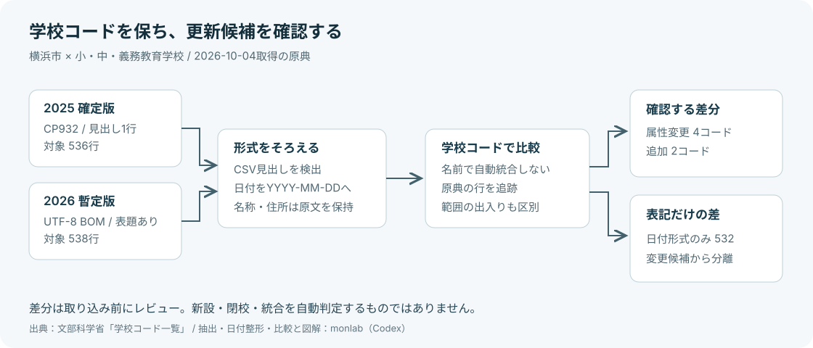

# 学校マスターの更新で、日付の書式差を拾わない

文部科学省の学校コード一覧を自社システムに取り込む開発者向けに、**横浜市の小・中・義務教育学校の更新差分**を整理したサンプルです。2025年5月1日基準の確定版と、2026年5月1日基準の暫定版を比較します。

元の一覧は[文科省から無料で取得できます](https://www.mext.go.jp/b_menu/toukei/mext_01087.html)。このサンプルは、原典の取得・整形・比較の手順と、取り込む前に確認する変更索引をまとめたものです。

## 日付の違いが、536件の変更に見える

実ファイルでは、2025版の文字コードはCP932、2026版はUTF-8 BOM付きでした。見出しの前に表題行が加わり、日付は `2020/12/22` から `2020-12-22` に変わっています。

横浜市の対象コードは、旧版536行、新版538行。旧版にある536コードの行を文字列のまま比べると、全て差があります。日付を実在する日付として検証し、YYYY-MM-DDにそろえると、属性変更は4コード、日付表記だけの差は532コードです。別に追加コード2件があります。



これらは**原典の属性行の差**です。現存校538校、新設2校、閉校2校といった数値には読み替えません。新版の対象には属性廃止日がある11行も含めています。

## 5分でサンプルを確認する

1. [v0.1のRelease](https://github.com/monlab202610/school-master-diff-yokohama/releases/tag/v0.1)から `school-master-sample-v0.1.zip` を取得して展開し、そのフォルダへ移動します。repoをcloneしても同じファイルを読めます。
2. [変更索引](index.md)で4件の属性変更と2件の追加を確認します。
3. Python 3がある環境で、学校コードを使って1件を検索します。追加パッケージ・APIキー・通信は不要です。

```sh
python3 examples/lookup.py B114110000024
```

このコードは、原典の学校名欄が「横浜国立大学教育学部附属横浜小学校」から「横浜国立大学附属横浜小学校」に変わった例です。名前をキーにせず、学校コードを照合キーにします。

SQLite CLIがある場合は、同じフォルダから変更候補と追加コードを表示できます。メモリ内だけで実行し、本番DBには接続しません。

```sh
sqlite3 :memory: < examples/lookup.sql
```

学校コードが見つからない場合、このサンプルの範囲外の可能性があります。不存在を判定する処理ではありません。

## 配布ファイル

| ファイル | 内容 |
| --- | --- |
| [before.csv](data/before.csv) | 2025確定版の対象536行、UTF-8・BOMなし |
| [after.csv](data/after.csv) / [after.json](data/after.json) | 2026暫定版の対象538行。同一レコードをCSV/JSONで提供 |
| [changes.json](data/changes.json) | コードごとの変更種別、変更列、before/after、原典追跡情報 |
| [schema.md](schema.md) | 文字列型、空欄、日付、廃止属性の意味 |
| [provenance.json](provenance.json) | 原典URL、取得時刻、SHA-256、版、加工内容 |
| [validation-report.md](validation-report.md) | 実原典照合、境界検査、再現性、利用例の実行結果 |

コード・郵便番号・旧調査番号は文字列です。CSVを表計算ソフトで開く際も数値化せず読み込んでください。JSONでは原典の空欄をnull、CSVでは空欄のまま表します。

## この索引の範囲

都道府県番号14、学校種B1/C1/C2、所在地が「神奈川県横浜市」で始まる行を抽出しました。国公私立・本分校・廃止属性を含みます。住所文字列による範囲指定で、地理境界を測った結果ではありません。

学校名・所在地は原文を保ち、名前での名寄せや住所正規化はしていません。後継関係は原典の移行後コード欄にある値だけを保存します。暫定版の訂正や、コード変更の例外はあり得ます。更新候補を確認してから自社の処理に取り込んでください。

元データは年度単位の基準日で公開され、訂正は随時あります。本サンプルは2026-10-04に取得した原典を固定しています。常に最新を提供するAPIではありません。

## 原典から再現する

配布用に全国rawを同梱していません。元の3ファイルが現在も同じ内容なら、次の手順でこの地域のサンプルを再現できます。

```sh
python3 scripts/fetch_sources.py --output raw
python3 scripts/build_sample.py --source-dir raw --output rebuilt
python3 -m unittest discover -s tests -v
```

取得処理は公式HTTPSの固定3ファイルだけを直列で取得し、要求間隔2秒以上、30秒タイムアウト、8MB上限、SHA照合を行います。原典が変わっていた場合は止まり、新しい版の確認が必要です。ダウンロードや再ビルドはこの配布物の利用数としてこちらへ送信されません。

## 役に立った作業を教えてください

このrepoの[任意の利用報告フォーム](https://github.com/monlab202610/school-master-diff-yokohama/issues/new/choose)で「使った版」「更新候補を確認できたか」「改善したい点」を記録できます。学生・顧客のデータ、メール、認証情報、本番ファイルは投稿しないでください。返信や個別対応を約束するものではありません。

同じ学校マスター担当者向けに、**全国の整形済み全量＋版間変更JSON＋検証履歴を2,980円/原典更新回**で提供する案を検討しています。**未制作・未販売**です。元データは無料です。必要な地域・反復する作業・この価格案を検討できるかという関心を、無料サンプルの利用報告とは別に任意で伺います。

## 出典と制作

文部科学省「学校コード一覧」をもとにmonlabが抽出・日付整形・比較して作成しました。取得日2026-10-04。文部科学省が作成・承認した加工物ではありません。[帰属とデータ利用条件](ATTRIBUTION.md)をご確認ください。

本説明・コード・図はAI（Codex）で作成し、原典との照合とコード実行を行いました。人間による利用経験や導入実績を意味するものではありません。自作コードは[MIT](LICENSE)、原典と加工データの利用条件は[DATA-LICENSE.md](DATA-LICENSE.md)で分けて記載しています。
